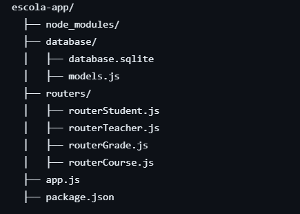
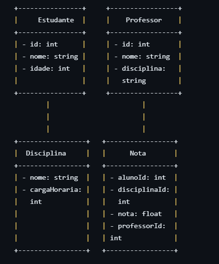

# Escola-App

  
  
  
  

## ÍNDICE
 [BRANCHS](#branchs)
 [ESTRUTURA](#estrutura)
 [UML](#uml)

## BRANCHS

: Não é possível executar um servidor Node.js com SQLite diretamente no GitHub Pages, mas é possível ver a disposição do modelo. Acesse https://victoria-belo.github.io/escola-app/ 

 

: Configurado para localhost. Baixe, instale e acesse http://localhost:3000/api 

## ESTRUTURA

## UML

### Estudante
Um estudante pode estar associado a muitas disciplinas.
Um estudante pode estar associado a muitos professores.
Um estudante pode ter muitas notas.

### Professor
Um professor pode estar associado a muitas disciplinas.
Um professor pode dar nota a muitos estudantes.

### Disciplina
Uma disciplina pode estar associada a muitos estudantes.
Uma disciplina pode ser lecionada por muitos professores.
Uma disciplina pode ter muitas notas.

### Nota
Cada nota está associada a um estudante.
Cada nota está associada a uma disciplina.
